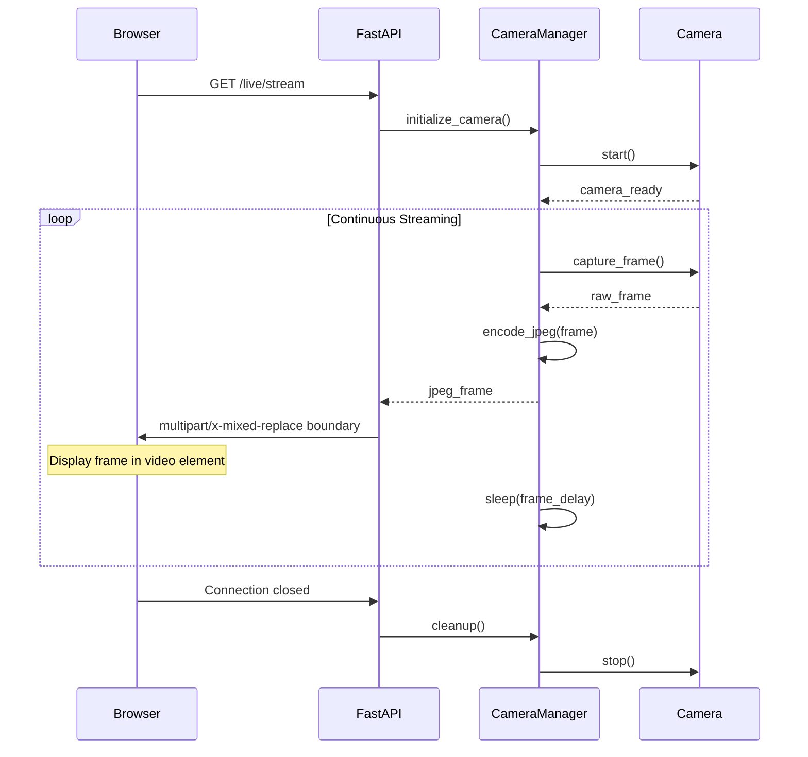

# Live Video Streaming Documentation

## Overview

PetLog implements MJPEG (Motion JPEG) streaming for real-time video monitoring. This document covers the streaming architecture, configuration, and usage.

## Architecture

### Components

1. **CameraManager** - Handles camera initialization and frame management
2. **CameraService** - Manages camera operations and configuration
3. **StreamingService** - Handles MJPEG frame generation and HTTP streaming
4. **Web Dashboard** - Frontend interface for stream control

### Data Flow

```
Camera Hardware → CameraService → StreamingService → HTTP Response → Browser
```



## Configuration

### Camera Settings

Camera configuration is managed through the `CameraService` class in `src/camera_service.py`:

```python
camera_config = CameraConfig(
    resolution=(1280, 720),    # Video resolution (width, height)
    frame_rate=15,             # Frames per second (1-60)
    quality=85,                # JPEG quality (1-100)
    enable_storage=False,      # Enable recording capability
    storage_path="recordings"  # Directory for recordings
)
```

The streaming service consumes frames from the camera service and handles MJPEG formatting for web delivery.

### Performance Tuning

- **Lower frame_rate** (10-15 FPS) for better performance on Raspberry Pi
- **Reduce resolution** for faster streaming over slow networks
- **Adjust quality** (70-90) to balance file size vs image quality

## API Endpoints

### Streaming Control

| Endpoint | Method | Description |
|----------|--------|-------------|
| `/live/stream` | GET | MJPEG video stream |
| `/live/start` | POST | Start camera streaming |
| `/live/stop` | POST | Stop camera streaming |
| `/live/status` | GET | Get streaming status |

### Recording Control

Recording is now integrated with the streaming endpoints:

- **Start with Recording**: Use `record_duration` parameter in `/live/start`
- **Stop with Recording**: `/live/stop` automatically stops any active recording

### Example Usage

```bash
# Start streaming
curl -X POST http://192.168.1.74:8000/live/start

# Get stream status
curl http://192.168.1.74:8000/live/status

# Start recording
curl -X POST http://192.168.1.74:8000/live/record/start

# Stop recording
curl -X POST http://192.168.1.74:8000/live/record/stop

# Stop streaming
curl -X POST http://192.168.1.74:8000/live/stop
```

## Web Dashboard

### Stream Controls

The web dashboard provides intuitive controls for:

- **Start Stream** - Initialize camera and begin streaming
- **Stop Stream** - Stop camera and end streaming
- **Record** - Start/stop video recording (when storage enabled)
- **Refresh** - Force refresh the video stream
- **Fullscreen** - View stream in fullscreen mode

### Status Indicators

- **Connection Status** - Shows API connectivity
- **Camera Status** - Displays current camera state
- **Recording Status** - Indicates if recording is active

## Development Mode

### Mock Camera

When running on non-Raspberry Pi systems, the application automatically uses a mock camera that generates:

- Timestamp overlay
- Moving elements for testing
- Proper MJPEG formatting

### Testing Without Hardware

```bash
# Run on development machine
python -m src.main

# Access dashboard
open http://192.168.1.74:8000

# Start mock stream
curl -X POST http://192.168.1.74:8000/live/start
```

## Troubleshooting

### Common Issues

1. **Camera not detected**
   - Ensure camera module is properly connected
   - Check if camera interface is enabled: `sudo raspi-config`
   - Verify with: `libcamera-hello --list-cameras`

2. **Stream not loading**
   - Check browser console for errors
   - Verify API endpoints are responding
   - Try refreshing the stream

3. **Poor performance**
   - Reduce frame rate in configuration
   - Lower resolution settings
   - Check network bandwidth

4. **Recording fails**
   - Ensure `enable_storage=True` in configuration
   - Check disk space availability
   - Verify write permissions to recordings directory

### Debug Commands

```bash
# Check camera status
curl http://192.168.1.74:8000/camera/status

# Check system health
curl http://192.168.1.74:8000/health

# View streaming status
curl http://192.168.1.74:8000/live/status
```

## Security Considerations

### Current Implementation

- No authentication required (development mode)
- HTTP only (no HTTPS)
- Local network access only

### Future Enhancements

- JWT token authentication
- HTTPS with SSL certificates
- Rate limiting for API endpoints
- User access controls

## Performance Metrics

### Raspberry Pi 4 Performance

| Resolution | FPS | CPU Usage | Network Bandwidth |
|------------|-----|-----------|-------------------|
| 640x480    | 30  | ~25%      | ~2 Mbps          |
| 1280x720   | 15  | ~35%      | ~3 Mbps          |
| 1920x1080  | 10  | ~50%      | ~5 Mbps          |

### Optimization Tips

1. **Use lower frame rates** for continuous monitoring
2. **Higher frame rates** only when actively viewing
3. **Adjust quality** based on network conditions
4. **Enable recording** only when needed

## Browser Compatibility

### Supported Browsers

- ✅ Chrome/Chromium (all versions)
- ✅ Firefox (all versions)
- ✅ Safari (macOS/iOS)
- ✅ Edge (all versions)

### MJPEG Support

All modern browsers support MJPEG streaming through standard `` tags with multipart content-type responses.

## Future Enhancements

### Planned Features

1. **WebRTC Support** - Lower latency streaming
2. **HLS Streaming** - Better mobile support
3. **Multiple Camera Support** - Multi-stream capability
4. **Adaptive Bitrate** - Dynamic quality adjustment
5. **Motion Detection** - Trigger recording on movement

### Integration Points

- Event detection system
- Alert notifications
- Cloud storage backup
- Mobile app support
